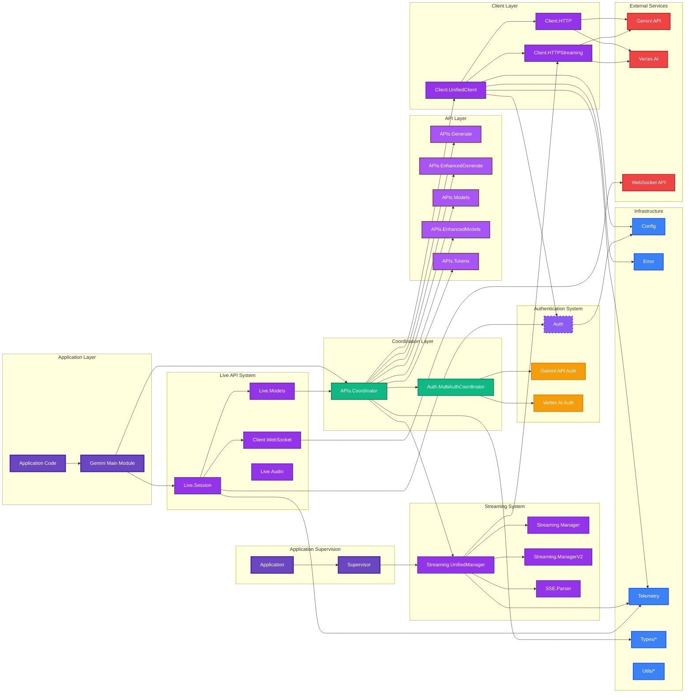

# Gemini Unified Client Architecture

This document provides a high-level overview of the Gemini Unified Client architecture based on the codebase in `lib/gemini`.

## System Overview

The Gemini Unified Client is designed as a modular, extensible system that provides a unified interface for interacting with both Gemini API and Vertex AI services while maintaining backward compatibility and supporting advanced features like streaming, multi-authentication, and telemetry.

## High-Level Architecture Diagram

## Core Components

### 1. Application Layer
- **Gemini Main Module**: Primary entry point providing backward-compatible API
- **Application Code**: User-facing interface for all Gemini operations

### 2. Coordination Layer
- **APIs.Coordinator**: Central orchestrator that routes requests and manages unified API operations
- **Auth.MultiAuthCoordinator**: Manages multiple authentication strategies concurrently

### 3. Client Layer
- **Client.UnifiedClient**: Unified HTTP client with comprehensive error handling and response parsing
- **Client.HTTP**: Standard HTTP client for request/response operations
- **Client.HTTPStreaming**: Specialized client for streaming operations

### 4. API Layer
- **APIs.Generate**: Core content generation functionality
- **APIs.EnhancedGenerate**: Enhanced generation with additional features
- **APIs.Models**: Model listing and management
- **APIs.EnhancedModels**: Enhanced model operations
- **APIs.Tokens**: Token counting and management

### 5. Streaming System
- **Streaming.UnifiedManager**: Main streaming manager with multi-auth support
- **Streaming.Manager**: Base streaming manager
- **Streaming.ManagerV2**: Enhanced streaming manager
- **SSE.Parser**: Server-Sent Events parser for streaming responses

### 6. Live API System (New in v0.9.0)
- **Live.Session**: GenServer managing WebSocket connection lifecycle with callback-based message routing
- **Live.Models**: Runtime model resolution based on API key capabilities and regional rollout status
- **Client.WebSocket**: WebSocket client using `:gun` for HTTP/2 + TLS connections
- **Live.Audio**: PCM audio handling utilities for native audio features

### 7. Authentication System
- **Auth**: Base authentication module
- **Multi-Authentication Support**: Concurrent support for both Gemini API and Vertex AI authentication

### 8. Infrastructure
- **Config**: Configuration management
- **Error**: Error handling and classification
- **Telemetry**: Instrumentation and monitoring
- **Types**: Type definitions and data structures
- **Utils**: Utility functions and helpers

## Key Architectural Principles

### 1. Unified Interface
The system provides a single, consistent API that abstracts away the differences between Gemini API and Vertex AI, allowing users to switch authentication strategies without changing their code.

### 2. Multi-Authentication Support
The architecture supports concurrent usage of multiple authentication strategies within the same application, enabling flexible deployment scenarios.

### 3. Modular Design
Each layer has clearly defined responsibilities and interfaces, making the system maintainable and extensible.

### 4. Streaming-First Architecture
Streaming capabilities are built into the core architecture rather than being an afterthought, providing robust real-time functionality.

### 5. Comprehensive Error Handling
Error handling is centralized and consistent across all components, providing clear error classification and recovery strategies.

### 6. Telemetry Integration
Built-in telemetry support provides visibility into system performance and behavior across all operations.

## Data Flow

### HTTP/Streaming API Flow
1. **Request Initiation**: Application code calls the main Gemini module
2. **Coordination**: The Coordinator determines the appropriate authentication strategy and API endpoint
3. **Authentication**: MultiAuthCoordinator handles authentication for the selected strategy
4. **Client Execution**: UnifiedClient executes the HTTP request with proper authentication
5. **Response Processing**: Responses are parsed, validated, and returned through the coordination layer
6. **Streaming Handling**: For streaming requests, UnifiedManager manages the stream lifecycle
7. **Telemetry**: All operations emit telemetry events for monitoring and observability

### Live API Flow (New in v0.9.0)
1. **Model Resolution**: `Live.Models.resolve/1` queries available models and selects the best match
2. **Session Creation**: `Live.Session.start_link/1` initializes a GenServer with configuration
3. **Connection**: `Session.connect/1` establishes WebSocket connection via `Client.WebSocket`
4. **Setup Handshake**: BidiGenerateContentSetup message sent, SetupComplete received
5. **Bidirectional Communication**: Messages sent via `send_client_content/2` or `send_realtime_input/2`
6. **Callback Routing**: Responses routed to `on_message`, `on_tool_call`, `on_error` callbacks
7. **Telemetry**: Live API events emitted for session lifecycle, messages, and tool calls
8. **Graceful Termination**: GoAway handling and session resumption token storage

## Supervision Strategy

The system uses OTP supervision principles with the Application module starting a supervisor that manages:

- **UnifiedManager**: For streaming operations
- **TaskSupervisor** (New in v0.9.0): Centralized supervision for async tasks in ConcurrencyGate, HTTPStreaming, ToolOrchestrator, and Interactions modules

This ensures fault tolerance, automatic recovery, and prevents resource leaks from unsupervised processes.

## Configuration Management

The Config module provides centralized configuration management that supports both global settings and per-request overrides, enabling flexible deployment and testing scenarios.
